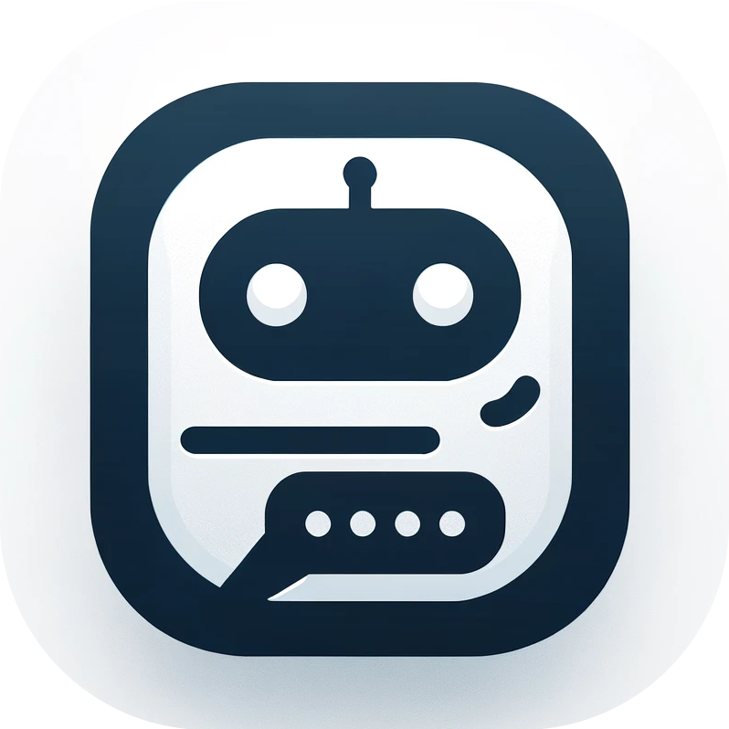
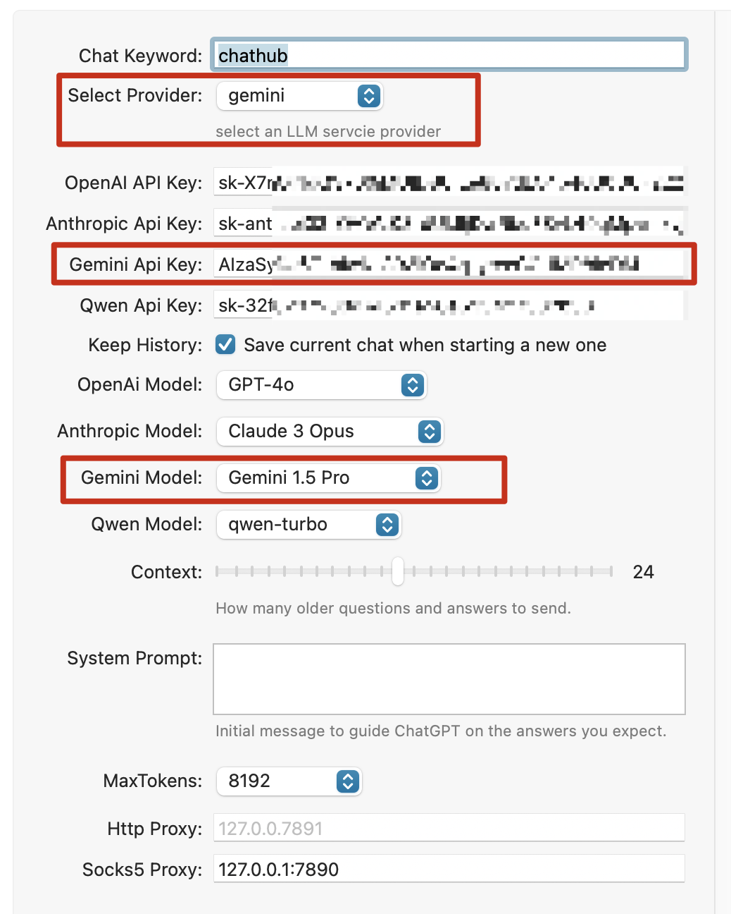
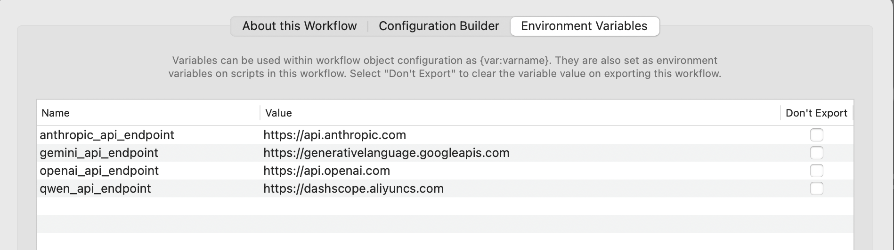
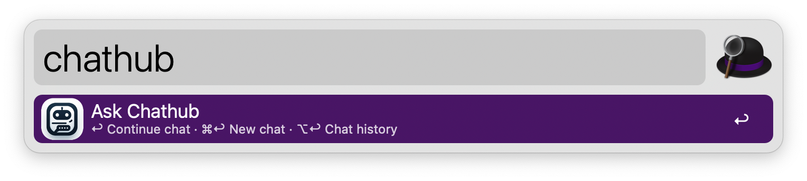
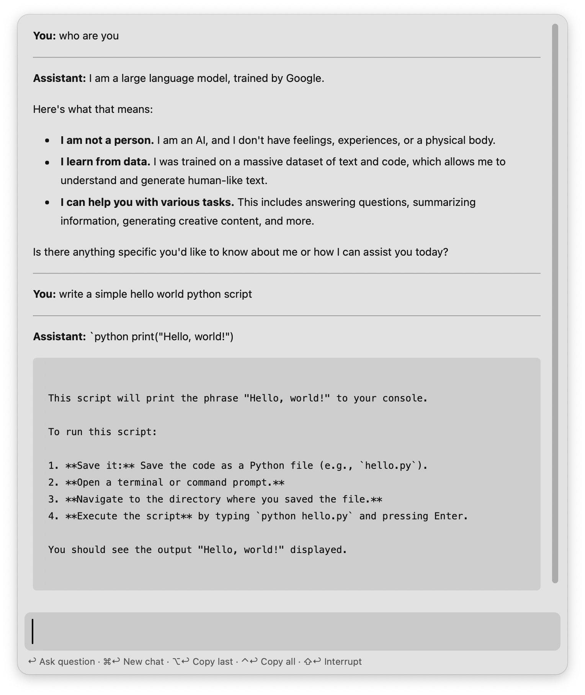
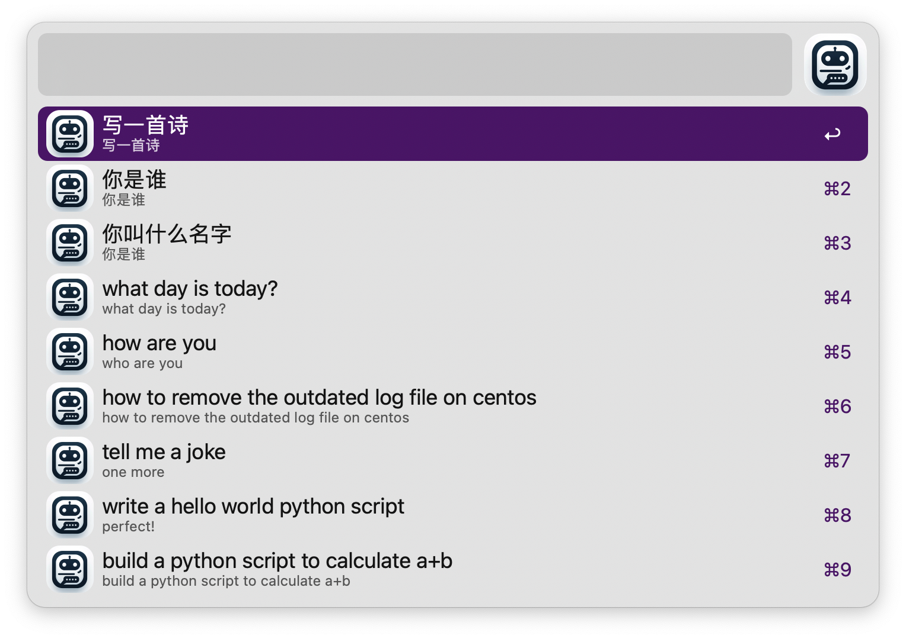

#  Alfred-Chathub

A chat tool that integrates multiple popular large language model (LLM) services, including OpenAI, Anthropic, Gemini, etc. Currently supports:
- [x] OpenAI
- [x] Anthropic
- [x] Gemini
- [x] Qwen

With the release of Alfred version 5.5, Alfred officially provided the [ChatGPT Workflow](https://github.com/alfredapp/openai-workflow), but it only supports OpenAI integration. When I installed and used it, my OpenAI API Key happened to be banned. Moreover, the ChatGPT Workflow is mainly based on JXA (JavaScript for Automation), which is difficult to extend. Therefore, I rewrote it in Python and extended support for other LLM services such as Anthropic and Gemini. Now, introducing support for a new LLM service is very easy.

## Prerequisites

1. You need to choose an LLM service, register an account on its official website, and obtain an API Key.
2. Install python3, ensuring that `/usr/bin/env python3 -c "import sys; print(sys.executable)"` prints the correct path to your python3.

Here is how to get those api-keys:
- OpenAI: https://platform.openai.com/api-keys
- Anthropic: https://console.anthropic.com/settings/keys
- Gemini: https://ai.google.dev/gemini-api/docs/api-key
- (Qwen)通义千问: https://help.aliyun.com/zh/dashscope/developer-reference/activate-dashscope-and-create-an-api-key

## Usage

1. Install the workflow. Typically, you just need to download the latest version from the release page and click to install it.
2. Perform basic configuration. You need to select a provider, and set the corresponding Api Key, Model. If necessary, set a proxy.

3. Make sure the endpoint is correct.

4. Start using it. Tips: You can add extra Hotkey Triggers for opening chat history or starting a new chat, that would bring smoother user experience.

